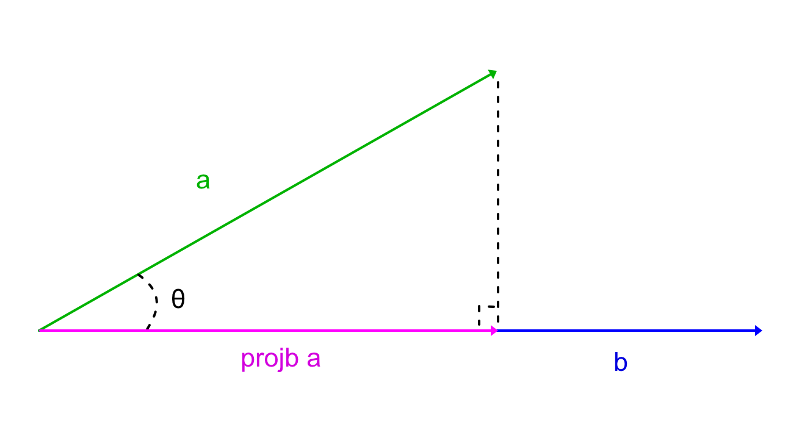

# Math
I can't seem to get used to the traditional math syntax, everything seems a lot simpler in code form in my eyes. So I made this page as quick reference to look up formulas and what the code form looks like.
# Vectors
## Vector Magnitude
How to calculate a vector's magnitude, or its length.
$$
\left \| \vec{v} \right \| = \sqrt{v.x^{2}+v.y^{2}}\\$$

In code form:
~~~glsl
    vec3 v;
    float v_length = sqrt(v.x*v.x + v.y*v.y);
~~~

in GLSL:
~~~glsl
    vec3 v;
    float v_length = length(v);
~~~
## Vector normalisation
A normalised, or unit, vector, is a vector with the same direction as the given vector but with a length of 1.
How to get a normlised, or unit, vector from a given vector:
$$
\hat{v} = \frac{\vec{v}}{\left \| \vec{v} \right \|}
$$
Or to put it in a more code friendly way:
~~~ glsl
    vec3 normalised_v = v/v_length;
~~~
 and in GLSL:

 ~~~ glsl
    vec3 normalised_v = normlize(v);
 ~~~

 ## Vector Projection
A vector projection is like rotating a vector until it is parallel to another vector. It can also be thought of as the shadow that a vector would project onto another vector. To figure out what the vector projection of a vector onto another is, we need to figure out the __scalar projection__. Once we have that, we can figure the vector projection.

    

There are two ways of calculating that projected scalar and vector: either with the angle $\Theta$ if it is known, or with vector a and b.

------
### Vector projection in term of $\Theta$
The formula for the scalar projection looks like this:

$$
scalar = {\left \|\vec{a} \right \|} cos \Theta
$$
 and the vector projection looks like this, $\hat{b}$ meaning a unit vector with same direction as $\vec{b}$:

 $$
projba = scalar\, \hat{b}
 $$

 or if we expend that using the formula for unit/normalised vectors:

 $$
projba = \left (\left \| \vec{a} \right \|\cos \Theta   \right )\frac{\vec{b}}{\left \| \vec{b} \right \|}
 $$

And in code would look something like this:
~~~glsl
vec3 proj = (length(a)*cos(theta))*normalize(b);
~~~

-----------
### Vector projection in terms of a and b
When we don't know what $\Theta$ is, wee can figure it out using the following property of a dot product:

$$
\frac{\vec{a}\cdot\vec{b} }{\left \|\vec{a} \right \| \left \| \vec{b} \right \|} = \cos \Theta 
$$

So the scalar projection formula in terms of $\Theta$ that we saw before becomes:
$$
scalar = {\left \|\vec{a} \right \|}\frac{\vec{a}\cdot \vec{b}}{\left \| \vec{a} \right \|\left \| \vec{b} \right \|}
$$
Which can be simplified to:
$$
scalar = \frac{\vec{a}\cdot \vec{b}}{\left \| \vec{b} \right \|}
$$

Now to figure out the vector projection, which is still $proj=scalar \,\hat{b}$, we can do this:

$$
proj = \frac{\vec{a}\cdot \vec{b}}{\left \| \vec{b} \right \|} \frac{\vec{b}}{\left \| \vec{b} \right \| }
$$

or:
$$
proj = (\vec{a} \cdot\hat{b})\hat{b}
$$

All that to say that to get a vector projection in code you can use the following code without having to wonder if you know $\Theta$ or not:

~~~glsl
vec3 proj = dot(a,normalize(b))*normalize(b);
~~~