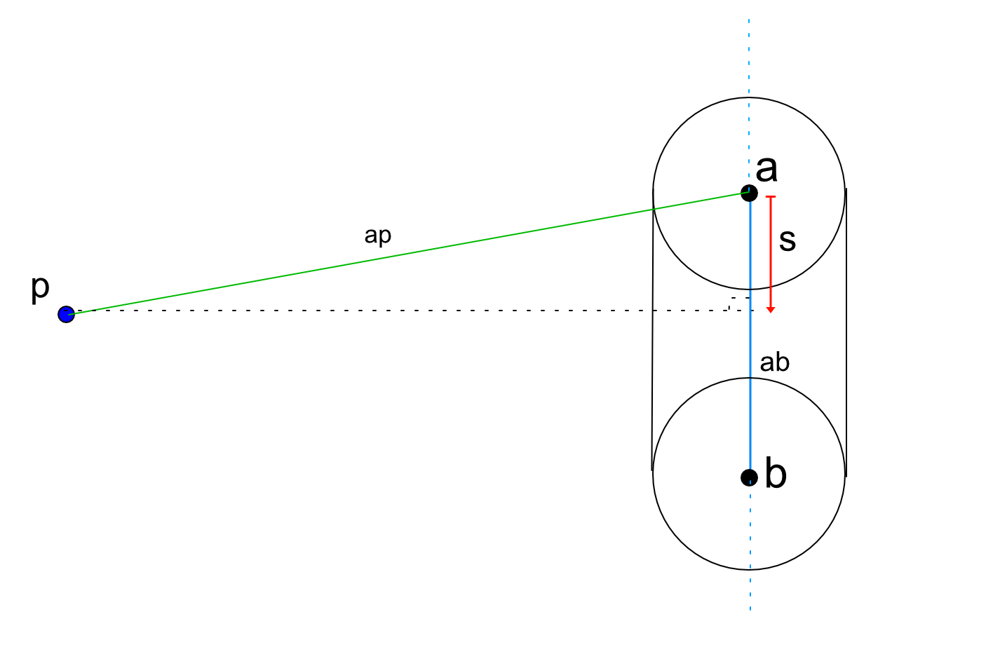
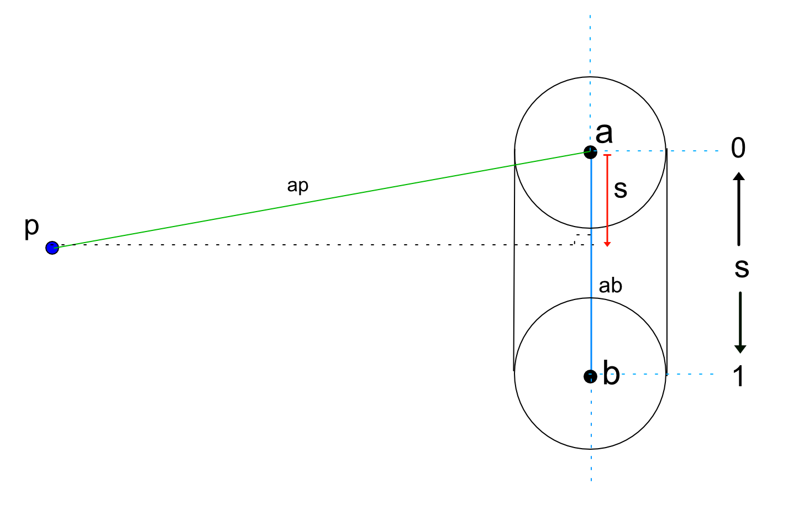
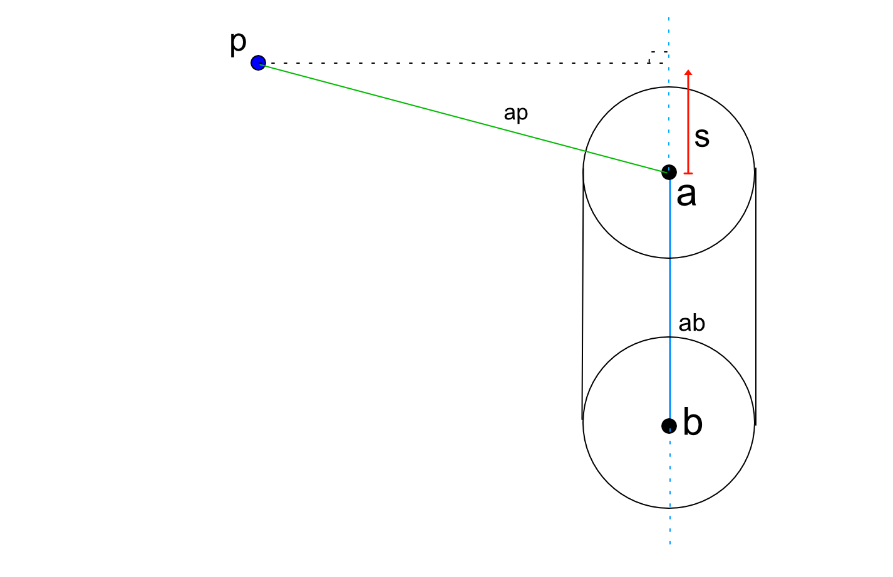
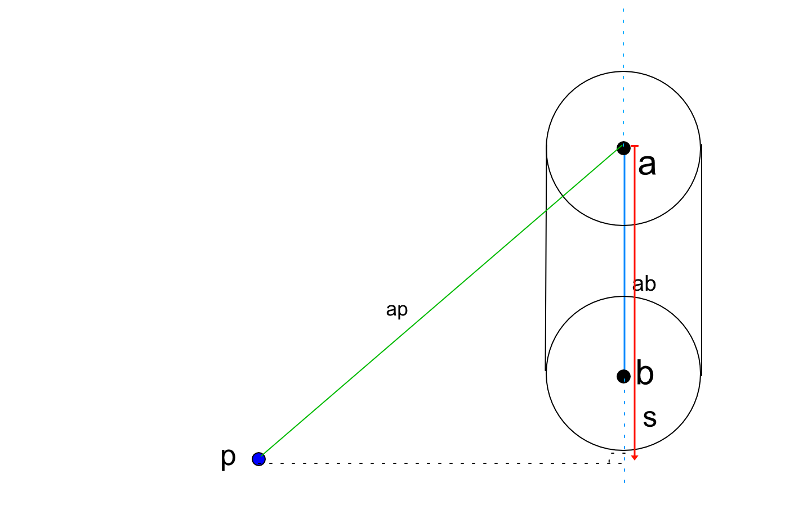
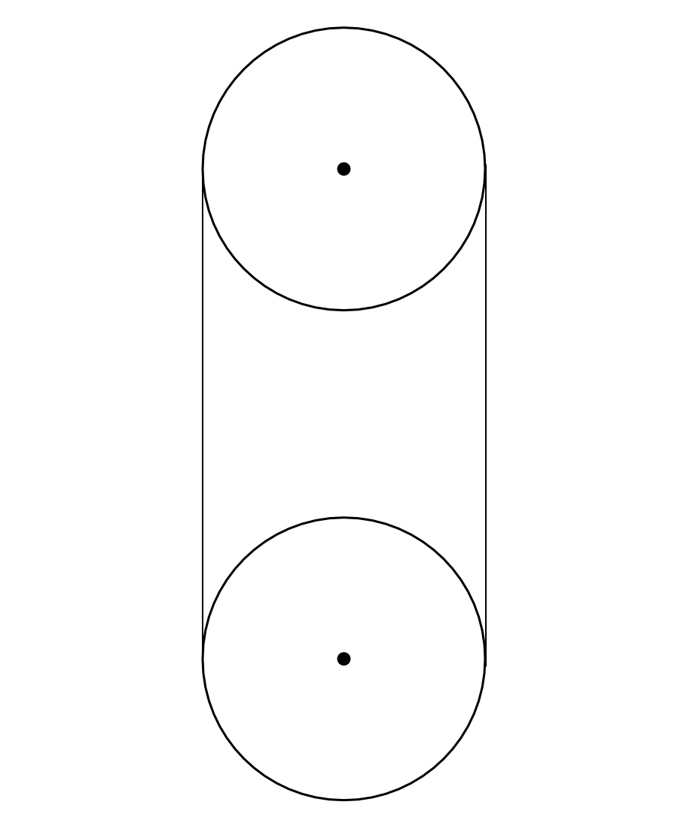

This section covers 3D SDFs. For an intro SDFs [here](../2D/index.md).
## Sphere
This one is the same as the [2D function](../2D/index.md).

## Capsule
Next are capsules, which are essentially two spheres joined together by a vector going from the center of one sphere to the center of the other.

The idea is to get a scalar projection _s_ of the vector _ap_ onto the vector _ab_, clamp that scalar between 0 and 1, and use it to move from _a_ in the direction of _ab_ by the scalar amount, to get the point _c_ on _ab_. From there, we can measure the distance _d_ from _p_ to _c_ and substract the radius _r_.
1. Function Signature

First let's set the function to take in our current position _p_, two vec3 that will be our spheres, and a float _r_ that will be our radius
~~~glsl
float sdfCapsule(vec3 p, vec3 a, vec3 b, float r)
~~~

2. Getting the scalar projection

The scalar projection is basically the length of a vector projected onto another. So on the diagram below we're trying to get the length of the red arrow. Another way to think of this is that the scalar projection is the size of a projected vector on a scale of _ab_. 

To do that we'll use a scalar projection of the vector _ap_ onto the vector _ab_.

To get the scalar projection of a vector onto another, the formula is:  $$\frac{\vec{ap} \cdot \vec{ab}}{\left \| \vec{ab} \right \|}$$

which gives us:

~~~glsl
float s = dot(ap, ab)/length(ab);
~~~
This will give us a float value that will be between 0 and 1 when _p_ is "above" _ab_, 0 being directly above _a_ and 1 being directly above _b_.

 

However if we take into consideration the case where _p_ is not above the capsule, our scalar projection will either go negative or go past the length of the vector _ab_, like it's the case on the diagram below.

And since our goal is to get a point on the vector _ab_ we need to make sure that our scalar is limited to the length of that vector.

We can easily do this by clamping our scalar _s_ between 0 and 1.

~~~glsl
s = clamp(s, 0., 1.);
~~~

3. Getting a vec3

 Since our goal is to get a point on the vector _ab_, and our scalar is a float, we need to find a way use that float to get the vector _c_ in pink below.

    

To do that we can use a similar logic that we used in the ray marching function.
We march from point _a_, in the direction of _ab_ by the amount of _s_.

~~~glsl
vec3 c = a + s * ab;
~~~
Easy.

4. Getting a distance

Now that we have a point, we can get the distance from our current position to that point. And to get the distance from our current position to the surface of the capsule, we can simply substract the radius.

~~~glsl
float d = length(p-c)-r;
~~~

and that's it, we have a signed distance function to draw capsules. Right now our function can only work with spheres that have the same radius, so let's bare that limitation in mind.

## Box
I'm still working on writing that :)
## Torus
I'm still working on writing that :)

---
# Credits
- [Ray Marching for Dummies](https://www.youtube.com/watch?v=PGtv-dBi2wE) by [The Art of Code](https://www.youtube.com/c/TheArtofCodeIsCool): explains the basic concepts simply and implements them in ShaderToy.
- [Ray Marching Primitives](https://www.shadertoy.com/view/wdf3zl) by [The Art of Code](https://www.youtube.com/c/TheArtofCodeIsCool): Explains the signed distance functions for some basic shapes, and does an implementation of them in ShaderToy.
- [Distance functions](https://iquilezles.org/articles/distfunctions/) by Inigo Quilez: A very useful reference that lists signed distance functions for basic primitive shapes.
- [Ray marching scene exemple](https://www.shadertoy.com/view/Xds3zN) by Inigo Quilez: A useful and complete exemple on how to use the distance functions, ray marching operators, camera transformations.