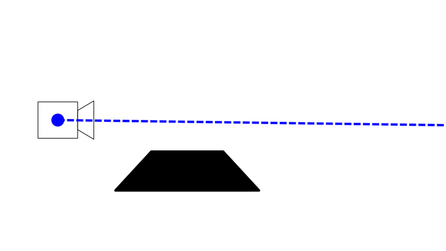

# Ray Marching / Sphere Marching
WIP obviously
## Ray marching
### Definition
Ray marching is a rendering method, where a ray is cast from a point of origin in a direction, and is subdivided into smaller segments until an intersection with a surface is detected. 
The segmentation is often done using spheres, hence the other name for ray marching: sphere marching. It can also be achieved using cubes, but that won't be covered here.
The surface that the ray intersects with is defined [signed distance functions](https://en.wikipedia.org/wiki/Signed_distance_function).

---
### How it works
Ray marching is very litteraly named. We are trying to move along a ray to find a surface. The movement along the ray is done in steps. For each step we check the distance from our current position to the closest surface, add that distance to the total distance traveled along the ray, and update our current position for the next step.


In the following stunning GIF, the steps are represented by the orange circles, the current position is the red circles, and the green line is the distance to the closest surface.



 We repeat that process until one of three things happen:

    1. We exceed the set maximum number of steps.

    2. The distance we measure is smaller than the minimum distance to a surface. In other words: we are close enough.

    3. The distance traveled along the ray exceeds the set maximum distance.

Once one of those conditions is met, we return the distance traveled along the ray, which corresponds to the distance from the camera to the surface. Then we move on to another ray, and repeat the whole process.

---

### Implementation
1. Casting Rays

The first thing we have to do is to cast rays that we can march along. This is the equivalent of a camera, it is placed in the world and points at something, or in other terms is has a position and a direction.
```glsl
    vec3 ray_origin = vec3(0,1,0);
    vec3 ray_direction = normalize(vec3(st.s, st.t, 1.));
```
The _ray_origin_ vector is quite simple, it's at the center of the world, slightly elevated above the scene.
The _ray_direction_ vector is a normalised, or unit vector that defines where the camera points. The first two parameters, _st.s_ and _st.t_ are the canvas coordinates, which means that we cast a ray for each fragment. The last parameter gives a "forward" direction in the z axis.

And with these two variables we have our camera, or rays.

2. Marching along the rays

The next step is to define the ray marching function. 

First we define the three variables we'll use as break conditions in our ray marching loop.
-  MAX_STEPS, the maximum number of steps to take along the ray. It will greatly determine how precise the ray marching will be. Can give cool morphing effects when set low.
- MAX_DIST the maximum distance we want to travel along our ray.
- SURFACE_DIST, the minimum value for the distance between the current position and the closest surface. In other words: it's precision. The smaller the number the closer to the surface our ray marching will go.

``` c
#define MAX_STEPS 100
#define MAX_DIST 100.
#define SURFACE_DIST 0.01
```

The we define the ray marching function, that we creatively call "raymarch".

``` glsl
float raymarch(vec3 ro, vec3 rd){
    float distance_traveled = 0.;
    for(int i = 0; i<MAX_STEPS; i++){
        vec3 current_pos = ro +distance_traveled*rd;
        float distance_closest = sdSphere(current_pos);
        distance_traveled += distance_closest;
        if(distance_closest<SURFACE_DIST || distance_traveled>MAX_DIST){break;}
    }

    return distance_traveled;
}
```
The raymarch function takes in the two ray variables we created earlier: the ray's origin _ro_ and the ray's direction _rd_.

We set the total distance traveled along the ray to 0.

Then we make a for loop that will run for the maximum number of steps. Inside this loop, we have our step code. First we set our current position to be how far we'll traveled along the ray so far. So for our first step, where we haven't marched along a ray yet, that would be our camera's position _ro_. 
```glsl
vec3 current_pos = ro +distance_traveled*rd;
```

Then we get the distance to the closest surface by calling sdSphere(), which will be explained in the __Signed Distance Functions__ chapter later. The distance is added to the total distance traveled, which will in turn change the current position of the next step.

```glsl
float distance_closest = sdSphere(current_pos);
distance_traveled += distance_closest;
```
And lastly, we check for break conditions that we talked about earlier.
```glsl
    if(distance_closest<SURFACE_DIST || distance_traveled>MAX_DIST){break;}
    }
```
---
## Signed Distance Functions
In the ray marching implementation we saw a function called sdSphere(), _sd_ stands for "signed distance", and without it we wouldn't have anything to display when we ray march.

Because of course the point of ray marching is to detect surfaces in our scene, so if we have no surfaces, we have nothing to detect. And we're not loading any 3D meshes or anything like this, so we have to get our surfaces from somewher.

This is where _signed distance functions_ come in. These functions 
## Basic shapes
Using distance functions, basic shapes can easily be drawn. inogo Quilez has a a lot of them listed on his [website](https://iquilezles.org/articles/distfunctions/). However he doesn't give explanations for them, so below are explanations on how to come up with some of these functions.
### Sphere
### Box
### Capsule
### Torus
---
# Credits
- [Ray Marching for Dummies](https://www.youtube.com/watch?v=PGtv-dBi2wE) by [The Art of Code](https://www.youtube.com/c/TheArtofCodeIsCool): explains the basic concepts simply and implements them in ShaderToy.
- [Ray Marching Primitives](https://www.shadertoy.com/view/wdf3zl) by [The Art of Code](https://www.youtube.com/c/TheArtofCodeIsCool): Explains the signed distance functions for some basic shapes, and does an implementation of them in ShaderToy.
- [Distance functions](https://iquilezles.org/articles/distfunctions/) by Inigo Quilez: A very useful reference that lists signed distance functions for basic primitive shapes.
- [Ray marching scene exemple](https://www.shadertoy.com/view/Xds3zN) by Inigo Quilez: A useful and complete exemple on how to use the distance functions, ray marching operators, camera transformations.